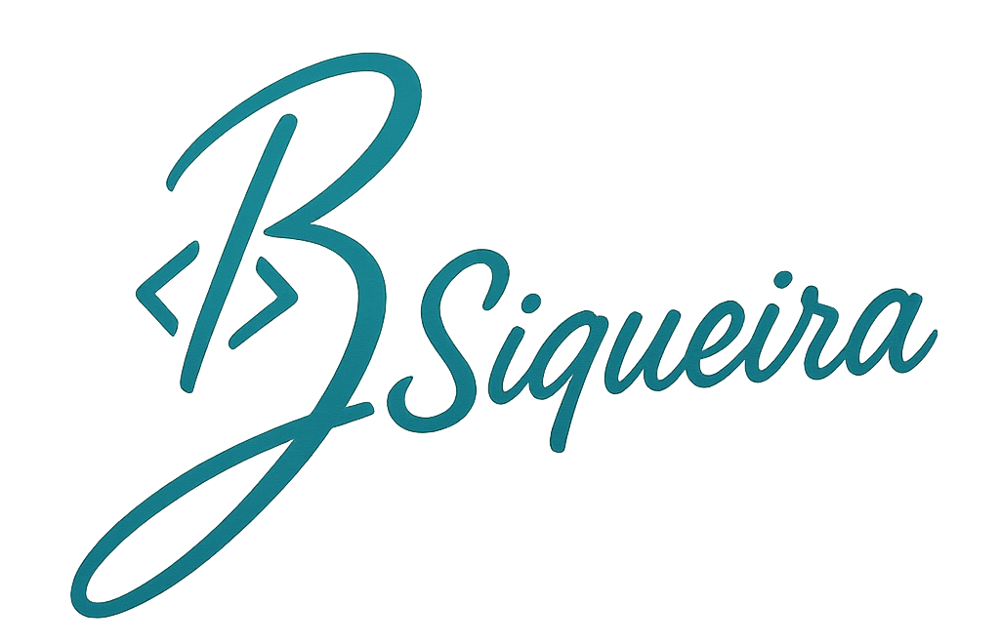
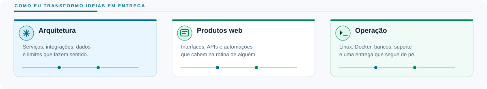
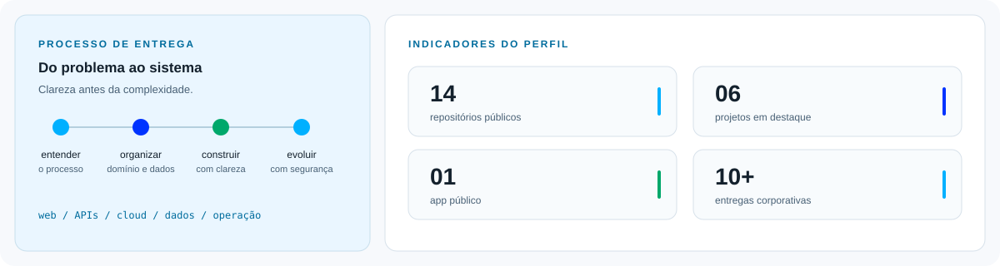
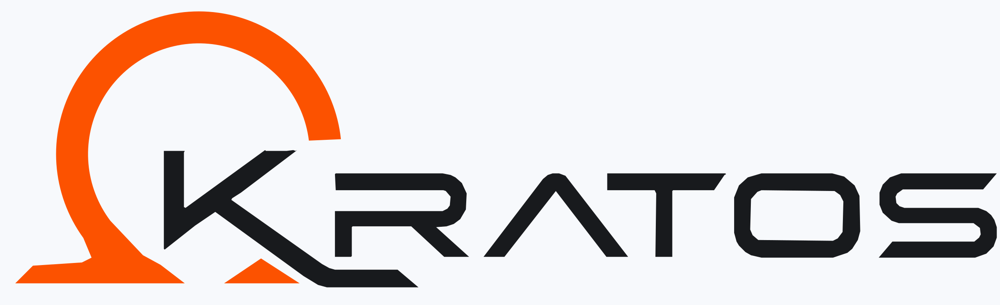

<div align="center">
  <p>
    <picture>
      <source media="(prefers-color-scheme: light)" srcset="./assets/official-signature.png">
      
    </picture>
  </p>

  <h1>Olá, eu sou Bruno Siqueira.</h1>

  <p><strong>Analista de TI | Arquiteto de Software | Web, Cloud e Integrações</strong></p>

  <p>Gosto de pegar processos confusos e transformar em sistemas que as pessoas conseguem usar e manter.</p>

  <p>
    <a href="https://brunosiqueira.tec.br/"></a>
    <a href="https://www.linkedin.com/in/bruno-siquieratec/"></a>
    <a href="mailto:contato@brunosiqueira.tec.br"></a>
  </p>
</div>

> Estou procurando minha próxima oportunidade em tecnologia. Tenho experiência entre suporte, desenvolvimento web, cloud e arquitetura de software.

## O que eu construo

<picture>
  <source media="(prefers-color-scheme: dark)" srcset="./assets/capabilities-dark.svg">
  <source media="(prefers-color-scheme: light)" srcset="./assets/capabilities-light.svg">
  
</picture>

## Visão rápida

<picture>
  <source media="(prefers-color-scheme: dark)" srcset="./assets/profile-signals-dark.svg">
  <source media="(prefers-color-scheme: light)" srcset="./assets/profile-signals-light.svg">
  
</picture>

## Trabalho selecionado

Alguns trabalhos que mostram como eu penso e construo, do produto público à operação corporativa.

<table width="100%">
  <tr>
    <td width="50%" valign="top">
      <a href="https://athonpace.fit/"></a><br>
      <h3><a href="https://athonpace.fit/">AthonPace</a></h3>
      <sub>APP PÚBLICO</sub><br>
      Planos de corrida para acompanhar rotina e evolução.<br>
      <sub>React · TypeScript · Supabase · Strava</sub>
    </td>
    <td width="50%" valign="top">
      <br>
      <h3>Kratos</h3>
      <sub>EXPERIÊNCIA CORPORATIVA</sub><br>
      FDS para agroquímicos, ETAM, Firebird e workflow.<br>
      <sub>Dados · automação · notificações</sub>
    </td>
  </tr>
  <tr>
    <td width="50%" valign="top">
      <a href="https://github.com/brusiqueira9/expense-guru-supabase"></a><br>
      <h3><a href="https://github.com/brusiqueira9/expense-guru-supabase">Expense Guru</a></h3>
      <sub>PRODUTO WEB</sub><br>
      Finanças pessoais com visão rápida do saldo.<br>
      <sub>React · TypeScript · Supabase</sub>
    </td>
    <td width="50%" valign="top">
      <a href="https://github.com/brusiqueira9/chamada_motorista"></a><br>
      <h3><a href="https://github.com/brusiqueira9/chamada_motorista">Chama Motorista</a></h3>
      <sub>AUTOMAÇÃO</sub><br>
      Chamada logística por voz, nome, placa e operação.<br>
      <sub>JavaScript · Web Speech API</sub>
    </td>
  </tr>
  <tr>
    <td width="50%" valign="top">
      <a href="https://github.com/brusiqueira9/ficha-reserva-hotel"></a><br>
      <h3><a href="https://github.com/brusiqueira9/ficha-reserva-hotel">Ficha de reserva</a></h3>
      <sub>FLUXO OPERACIONAL</sub><br>
      Reservas padronizadas e PDFs para hotéis.<br>
      <sub>HTML · CSS · JavaScript · jsPDF</sub>
    </td>
    <td width="50%" valign="top">
      <a href="https://github.com/brusiqueira9/linux-projeto1-iac"></a><br>
      <h3><a href="https://github.com/brusiqueira9/linux-projeto1-iac">Linux e IaC</a></h3>
      <sub>INFRAESTRUTURA</sub><br>
      Automação Bash de ambientes, usuários e permissões.<br>
      <sub>Shell Script · Linux · IaC</sub>
    </td>
  </tr>
</table>

<details>
  <summary><strong>Outras entregas corporativas</strong></summary>

  <br>

  Também já trabalhei com integração de sistemas, monitoramento de dispositivos, vínculo com ERP, consulta de pedidos e processamento de planilhas Excel.
</details>

## Como eu penso

```text
  entender o processo  →  organizar o essencial  →  construir  →  melhorar com o uso
```

- Antes de escolher a tecnologia, tento entender o que precisa funcionar de verdade.
- Prefiro uma solução simples, bem organizada e pronta para crescer.
- Entregar também é documentar, integrar e deixar a operação tranquila para quem vai usar.

## Stack

<p>
  
  
  
  
  
  
  
</p>
<p>
  
  
  
  
  
  
</p>

<details>
  <summary>Mais ferramentas</summary>

  <br>

  APIs REST, JWT, Shell/Bash, Oracle SQL Developer, Microsoft SQL Server, Firebase, Tailwind CSS, shadcn/ui, Web Speech API, ExcelJS e jsPDF.
</details>

## Experiência e formação

- Última experiência: Analista de Suporte de TI na AgroCP.
- MBA em Arquitetura de Microsserviços.
- Pós-graduação em Arquitetura de Software.
- Tecnologia em Computação em Nuvem.

## Contato

Se o seu time precisa de alguém que transite entre suporte, produto e engenharia, [vamos conversar](mailto:contato@brunosiqueira.tec.br).

<p>
  <a href="mailto:contato@brunosiqueira.tec.br"></a>
  <a href="https://www.linkedin.com/in/bruno-siquieratec/"></a>
  <a href="https://brunosiqueira.tec.br/"></a>
</p>

<p align="center"><sub>Clareza no processo. Intenção na arquitetura. Espaço para evoluir.</sub></p>
