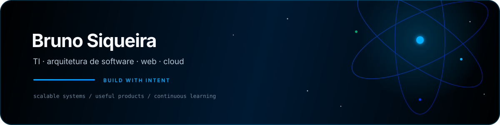
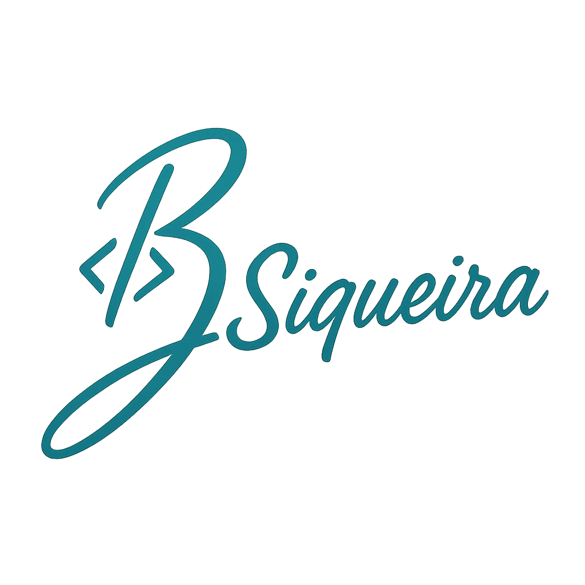
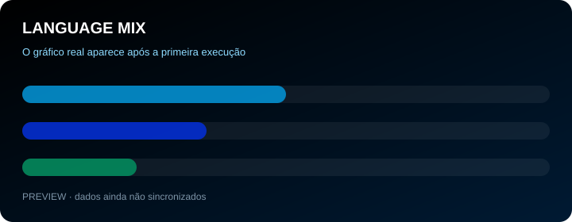
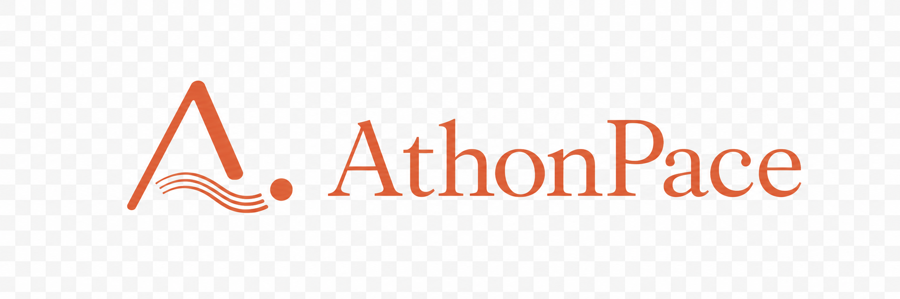

  
    
  

  

    <strong>Analista de TI · Arquiteto de Software · Cloud Computing · Desenvolvimento Web</strong>
  

  

    
    
    
  

## A proposta

Transformo desafios de negócio em soluções web práticas, escaláveis e fáceis de manter. Minha experiência combina suporte técnico, administração de ambientes, desenvolvimento de aplicações e visão de arquitetura.

Estou disponível para uma nova oportunidade em tecnologia, especialmente em times que valorizem clareza, colaboração e evolução contínua.

## O que eu construo

<table>
  <tr>
    <td width="50%" valign="top">
      <strong>Arquitetura de software</strong> 
      Sistemas escaláveis, resilientes, distribuídos e orientados a microsserviços.
    </td>
    <td width="50%" valign="top">
      <strong>Produtos web</strong> 
      Interfaces, APIs REST, integrações e automações que resolvem problemas reais.
    </td>
  </tr>
  <tr>
    <td width="50%" valign="top">
      <strong>Cloud e infraestrutura</strong> 
      Docker, Linux, administração de ambientes, migrações e práticas de CI/CD.
    </td>
    <td width="50%" valign="top">
      <strong>Dados e operação</strong> 
      SQL, Oracle, Firebird, Microsoft SQL Server, Firebase e Supabase.
    </td>
  </tr>
</table>

## Stack

  
  
  
  
  
  
  
  
  
  
  
  
  

  
Outras ferramentas e conhecimentos

  APIs REST · JWT · Shell/Bash · Oracle SQL Developer · Microsoft SQL Server · Firebase · Tailwind CSS · shadcn/ui · Web Speech API · ExcelJS · jsPDF

## Sinais de atividade

  

<table>
  <tr>
    <td width="50%" valign="top">
      
    </td>
    <td width="50%" valign="top">
      
    </td>
  </tr>
</table>

  Atualizado automaticamente por <a href="https://github.com/lowlighter/metrics">lowlighter/metrics</a> · horário de Brasília · execução diária

## Trabalho selecionado

<table>
  <tr>
    <td width="50%" valign="top">
      <h3><a href="https://athonpace.fit/">AthonPace</a></h3>
      
      
Aplicativo público de corrida com planos individualizados que acompanham rotina, esforço e evolução.

      React · TypeScript · Supabase · Strava
    </td>
    <td width="50%" valign="top">
      <h3>Kratos</h3>
      
      
Gestão corporativa de Fichas de Dados de Segurança para produtos agroquímicos, com Firebird, ETAM automático, notificações e workflows.

      Projeto corporativo não público
    </td>
  </tr>
  <tr>
    <td width="50%" valign="top">
      <h3><a href="https://github.com/brusiqueira9/expense-guru-supabase">Expense Guru</a></h3>
      
      
Controle financeiro pessoal com dashboard, receitas, despesas e metas.

      React · TypeScript · Supabase · shadcn/ui
    </td>
    <td width="50%" valign="top">
      <h3><a href="https://github.com/brusiqueira9/chamada_motorista">Chama Motorista</a></h3>
      
      
Chamadas logísticas por voz com Web Speech API e armazenamento local.

      JavaScript · Web Speech API · LocalStorage
    </td>
  </tr>
  <tr>
    <td width="50%" valign="top">
      <h3><a href="https://github.com/brusiqueira9/ficha-reserva-hotel">Ficha de reserva de hotel</a></h3>
      
      
Geração de PDFs personalizados para padronizar reservas de hotel.

      HTML · CSS · JavaScript · jsPDF
    </td>
    <td width="50%" valign="top">
      <h3><a href="https://github.com/brusiqueira9/linux-projeto1-iac">Linux e IaC</a></h3>
      
      
Automação Bash de usuários, grupos, diretórios e permissões.

      Shell Script · Linux · Administração de sistemas
    </td>
  </tr>
</table>

## Experiência e formação

- Analista de Suporte de TI na AgroCP — experiência profissional mais recente
- MBA em Arquitetura de Microsserviços
- Pós-graduação em Arquitetura de Software
- Tecnologia em Computação em Nuvem

Na prática, também desenvolvi soluções para integração de aplicações, monitoramento de dispositivos, centralização de serviços, consulta de pedidos, processamento de planilhas e integração com bancos Oracle, MySQL e Firebird.

## Vamos conversar

  
  
  
  

