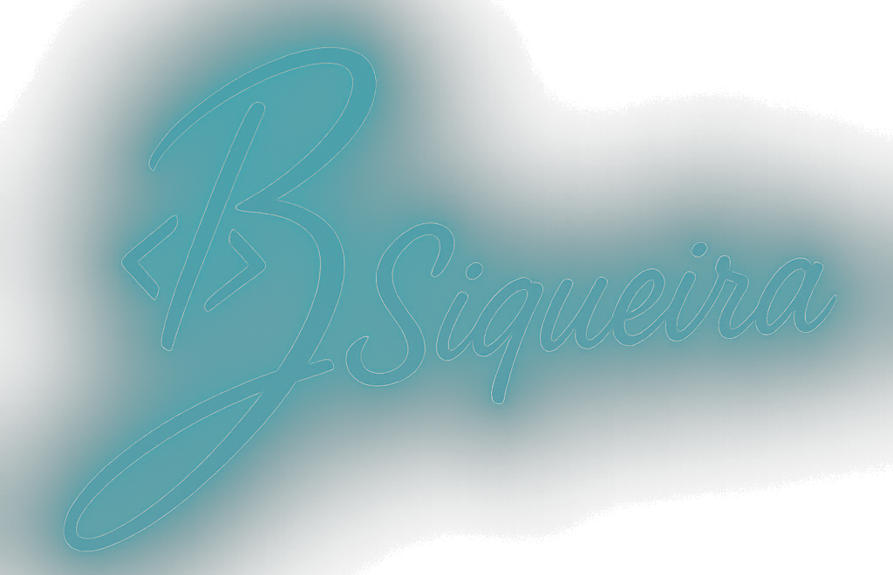
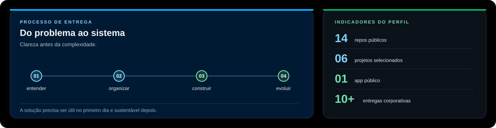
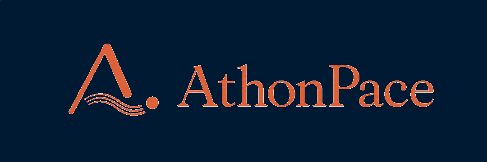
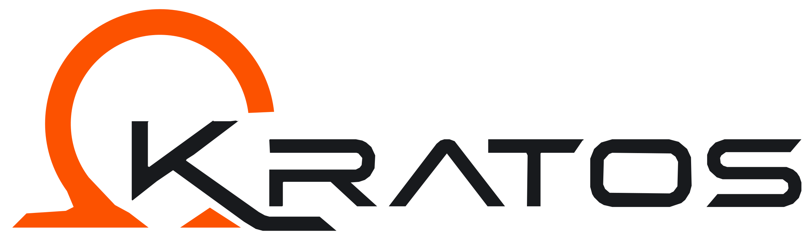
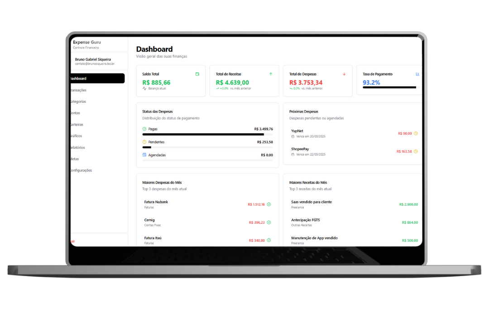
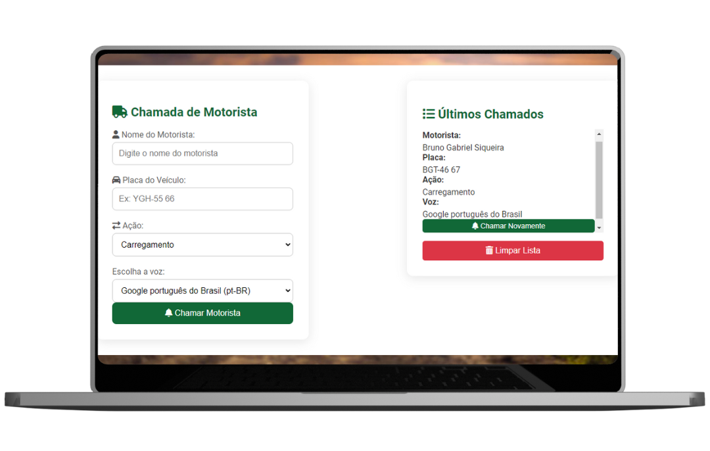
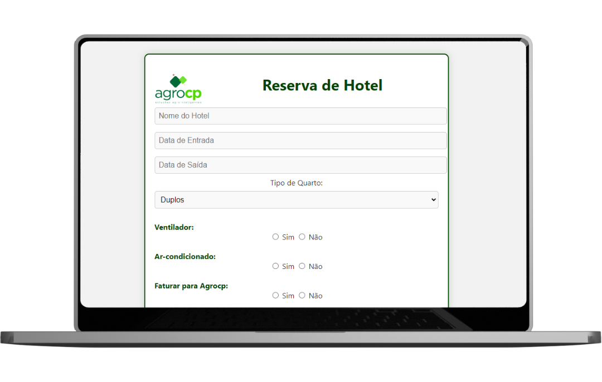
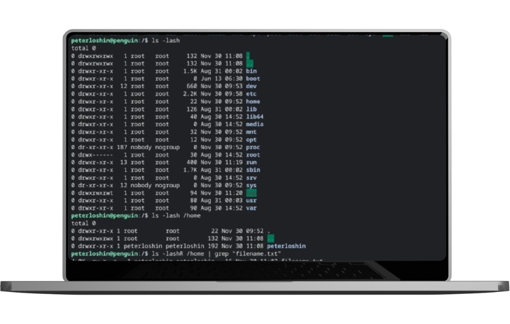

<div align="center">
  <picture>
    <source media="(prefers-color-scheme: light)" srcset="./assets/official-signature.png">
    
  </picture>

  <h1>Olá, eu sou Bruno Siqueira.</h1>

  <p><strong>Analista de TI · Arquiteto de Software · Desenvolvimento Web · Cloud</strong></p>

  <p>Transformo processos reais em sistemas claros, integrados e prontos para evoluir.</p>

  <p>
    <a href="https://brunosiqueira.tec.br/"></a>
    <a href="https://www.linkedin.com/in/bruno-siquieratec/"></a>
    <a href="mailto:contato@brunosiqueira.tec.br"></a>
  </p>
</div>

<hr>

<p align="center">
  <a href="#sobre">Sobre</a> ·
  <a href="#trabalho-selecionado">Trabalho selecionado</a> ·
  <a href="#como-eu-penso">Como eu penso</a> ·
  <a href="#stack">Stack</a> ·
  <a href="#contato">Contato</a>
</p>

> Disponível para novas oportunidades em tecnologia, especialmente em arquitetura, desenvolvimento web, cloud, integração de sistemas e resolução de problemas operacionais.

## Sobre

Minha experiência combina suporte técnico, administração de ambientes, desenvolvimento web e arquitetura de software. Gosto de atuar no ponto em que negócio e tecnologia se encontram: entender o fluxo, organizar os dados, escolher a solução adequada e entregar algo que continue fazendo sentido depois da primeira versão.

<table width="100%">
  <tr>
    <td width="33%" valign="top"><strong>Arquitetura</strong><br>Serviços, integrações, dados e limites bem definidos.</td>
    <td width="33%" valign="top"><strong>Produtos web</strong><br>Interfaces, APIs e automações para uso diário.</td>
    <td width="33%" valign="top"><strong>Operação</strong><br>Linux, Docker, bancos, suporte e entrega contínua.</td>
  </tr>
</table>

## Sinais do trabalho

<picture>
  <source media="(prefers-color-scheme: light)" srcset="./assets/profile-signals-light.svg">
  
</picture>

## Trabalho selecionado

Projetos que mostram problemas diferentes, mas a mesma preocupação: reduzir atrito e transformar rotina em fluxo confiável.

<table>
  <tr>
    <td width="50%" valign="top">
      <h3><a href="https://athonpace.fit/">AthonPace</a></h3>
      <table><tr><td bgcolor="#001A33" align="center"></td></tr></table>
      <strong>Produto público de corrida</strong><br>
      App com planos individualizados para acompanhar rotina, esforço e evolução de cada corredor.
      <br><br><sub>React · TypeScript · Supabase · Strava · Produto em produção</sub>
    </td>
    <td width="50%" valign="top">
      <h3>Kratos</h3>
      <table><tr><td bgcolor="#F7F9FC" align="center"></td></tr></table>
      <strong>Solução corporativa para agroquímicos</strong><br>
      Geração e administração de Fichas de Dados de Segurança, banco Firebird, cálculo ETAM automático, matérias-primas, notificações por e-mail e workflow.
      <br><br><sub>Projeto não público · Desenvolvido em experiência corporativa</sub>
    </td>
  </tr>
  <tr>
    <td width="50%" valign="top">
      <h3><a href="https://github.com/brusiqueira9/expense-guru-supabase">Expense Guru</a></h3>
      <table><tr><td bgcolor="#001A33" align="center"></td></tr></table>
      Dashboard financeiro para receitas, despesas, metas e visão do saldo.<br><br><sub>React · TypeScript · Supabase · shadcn/ui</sub>
    </td>
    <td width="50%" valign="top">
      <h3><a href="https://github.com/brusiqueira9/chamada_motorista">Chama Motorista</a></h3>
      <table><tr><td bgcolor="#001A33" align="center"></td></tr></table>
      Sistema de chamada logística por voz com nome, placa e tipo de operação.<br><br><sub>JavaScript · Web Speech API · LocalStorage</sub>
    </td>
  </tr>
  <tr>
    <td width="50%" valign="top">
      <h3><a href="https://github.com/brusiqueira9/ficha-reserva-hotel">Ficha de reserva</a></h3>
      <table><tr><td bgcolor="#001A33" align="center"></td></tr></table>
      Fluxo para padronizar reservas e gerar PDFs personalizados para hotéis parceiros.<br><br><sub>HTML · CSS · JavaScript · jsPDF</sub>
    </td>
    <td width="50%" valign="top">
      <h3><a href="https://github.com/brusiqueira9/linux-projeto1-iac">Linux e IaC</a></h3>
      <table><tr><td bgcolor="#001A33" align="center"></td></tr></table>
      Automação Bash de usuários, grupos, diretórios e permissões em ambientes Linux.<br><br><sub>Shell Script · Linux · Administração de sistemas</sub>
    </td>
  </tr>
</table>

<details>
  <summary><strong>Outras entregas corporativas</strong></summary>

  <br>

  Hub de sistemas integrados · Monitoramento de dispositivos e impressoras · Vínculo de itens com ERP · Consulta de status de pedidos · Processamento de planilhas Excel.
</details>

## Como eu penso

```text
entender o processo  →  organizar domínio e dados  →  construir com clareza  →  deixar evoluir
```

- Começo pelo problema, pelas pessoas e pelo resultado esperado.
- Escolho a menor arquitetura que resolva bem o cenário atual sem bloquear o próximo passo.
- Cuido da operação: documentação, logs, permissões, integração e manutenção fazem parte da entrega.

## Stack

<p>
  
  
  
  
  
  
  
</p>
<p>
  
  
  
  
  
  
</p>

<details>
  <summary>Mais ferramentas</summary>

  <br>

  APIs REST · JWT · Shell/Bash · Oracle SQL Developer · Microsoft SQL Server · Firebase · Tailwind CSS · shadcn/ui · Web Speech API · ExcelJS · jsPDF
</details>

## Experiência e formação

- Última experiência: Analista de Suporte de TI na AgroCP.
- MBA em Arquitetura de Microsserviços.
- Pós-graduação em Arquitetura de Software.
- Tecnologia em Computação em Nuvem.

## Contato

Se você está formando um time e precisa conectar produto, operação e engenharia, vamos conversar.

<p>
  <a href="mailto:contato@brunosiqueira.tec.br"></a>
  <a href="https://www.linkedin.com/in/bruno-siquieratec/"></a>
  <a href="https://brunosiqueira.tec.br/"></a>
</p>

<p align="center"><sub>Clareza no processo. Intenção na arquitetura. Espaço para evoluir.</sub></p>
